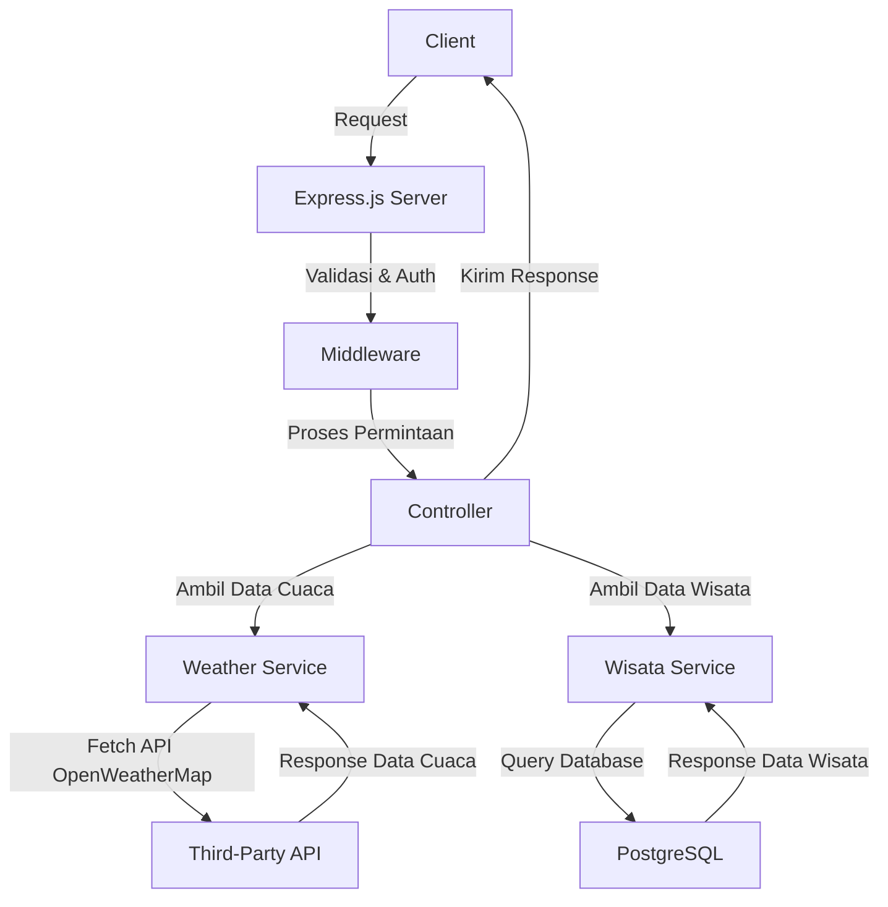

Berikut adalah file **`backend_architecture.md`** yang menjelaskan arsitektur backend proyek kamu. 🚀  

```md
# 🏗 Dokumentasi Arsitektur Backend

## 📌 1. Pendahuluan
Backend sistem ini dikembangkan menggunakan **Node.js** dengan framework **Express.js**, serta menggunakan **PostgreSQL** sebagai database utama. Sistem ini menyediakan API untuk mengelola data cuaca, tempat wisata, serta rekomendasi aktivitas berdasarkan kondisi cuaca.

---

## 🏛 2. Arsitektur Sistem
### 🔹 **Teknologi yang Digunakan**
- **Backend Framework**: Node.js + Express.js
- **Database**: PostgreSQL
- **ORM/Query Builder**: Sequelize
- **Authentication**: JSON Web Token (JWT)
- **API Cuaca**: OpenWeatherMap API
- **Deployment**: Docker, Railway/VPS

---

## 🔀 3. Diagram Alur Backend



**Penjelasan**:
1. **Client** mengirim request ke backend.
2. **Express.js Server** menerima request.
3. **Middleware** menangani autentikasi & validasi.
4. **Controller** memproses request & menentukan service yang digunakan.
5. **Weather Service** mengambil data dari **API OpenWeatherMap**.
6. **Wisata Service** mengambil data dari **PostgreSQL**.
7. **Hasilnya dikirim kembali** ke client dalam format JSON.

---

## 📂 4. Struktur Folder Backend
```
backend/
│── src/
│   ├── config/          # Konfigurasi database & environment
│   │   ├── db.js        # Koneksi PostgreSQL
│   │   ├── env.js       # Load & validasi environment variables
│   │
│   ├── controllers/     # Logic untuk menangani request dari client
│   │   ├── weatherController.js   # Controller untuk cuaca
│   │   ├── wisataController.js    # Controller untuk wisata
│   │
│   ├── models/         # Definisi model database
│   │   ├── weatherModel.js    # Model cuaca
│   │   ├── wisataModel.js     # Model wisata
│   │
│   ├── routes/         # Routing API
│   │   ├── weatherRoutes.js   # Route untuk data cuaca
│   │   ├── wisataRoutes.js    # Route untuk data wisata
│   │
│   ├── services/       # Business logic (pengolahan data dari API/dataset)
│   │   ├── weatherService.js  # Service untuk cuaca
│   │   ├── wisataService.js   # Service untuk wisata
│   │
│   ├── middleware/     # Middleware untuk validasi, autentikasi, dsb.
│   │   ├── authMiddleware.js  # Middleware autentikasi
│   │   ├── errorHandler.js    # Middleware error handling
│   │
│   ├── utils/          # Helper functions (misalnya format tanggal, logger)
│   │   ├── logger.js         # Logging
│   │   ├── responseHelper.js # Helper untuk response API
│   │
│   ├── app.js          # Setup aplikasi Express
│   ├── server.js       # Entry point server
│
├── .env                # Variabel lingkungan
├── .gitignore          # File yang tidak perlu dikirim ke Git
├── package.json        # Konfigurasi proyek Node.js
├── README.md           # Dokumentasi proyek
```

---

## 📡 5. API Cuaca yang Digunakan
Sistem ini mengambil data cuaca dari **OpenWeatherMap API** untuk memberikan rekomendasi aktivitas di tempat wisata.

### 🌍 **Contoh Request ke OpenWeatherMap API**
```http
GET https://api.openweathermap.org/data/2.5/weather?q=Probolinggo&appid=YOUR_API_KEY&units=metric
```

### 📤 **Response JSON**
```json
{
  "weather": [{"main": "Clear", "description": "clear sky"}],
  "main": {"temp": 30.5, "humidity": 60},
  "wind": {"speed": 2.1},
  "name": "Probolinggo"
}
```

---

## ✅ 6. Kesimpulan
Arsitektur backend ini dibuat untuk menangani pengolahan data cuaca dan wisata, dengan struktur modular yang memudahkan pengembangan dan pemeliharaan. API yang dibuat akan memberikan data yang dibutuhkan oleh frontend untuk menampilkan informasi kepada pengguna.

🔥 **Siap untuk dikembangkan lebih lanjut!** 🚀
```